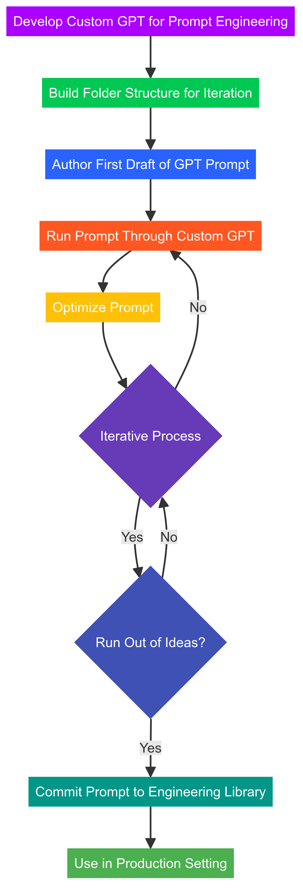

# The Iterative Cycle Of GPT Prompt Engineering - Summary Version

The Iterative Cycle of GPT Prompt Engineering describes a workflow for achieving iteratively better GPT outputs.

It involves the following steps:

- Firstly the user develops a custom GPT for the sole purpose of prompt engineering. There are suggested configuration texts in this repository although it's also possible to use the GPT itself for the purpose of creating an optimised custom GPT configuration. 

Next, the user builds a folder structure for iterating through GPT prompts. Any Git-based filesystem could be used for version control or the user could save each version of the prompt as a separate file. 

In this phase of the cycle the user:

- Authors a first draft of the GPT prompt
- Runs that GPT prompt through the custom GPT asking the GPT to optimise the prompt according to latest best practices for prompt engineering in the target GPT

In a shortened version of the process the user runs the prompt through the prompt engineering GPT only one time. However the user may attempt to generate iterative versions of the prompt by adding text like "edit this prompt so that the output is even more comprehensive" (etc, etc).

Eventually the GPT will run out of ideas for improving the prompt. At this point the prompt is finished and is ready to be committed to a prompt engineering library and used in a "production" generative AI enhanced setting.

## Schematic

## Authorship

Daniel Rosehill

public at danielrosehill dot com